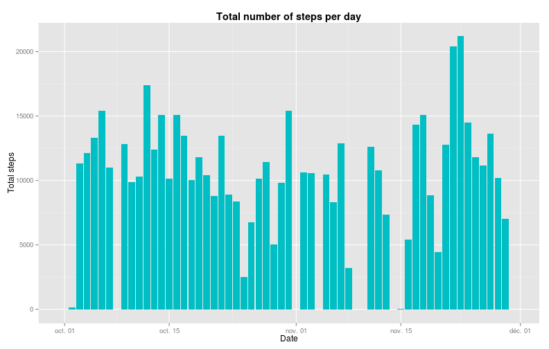
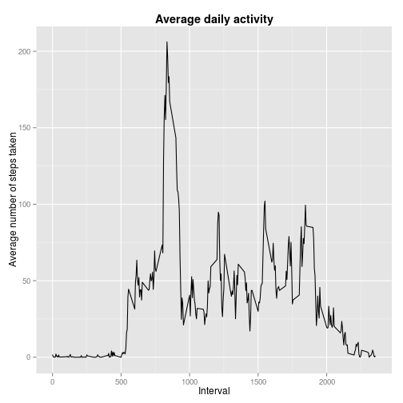
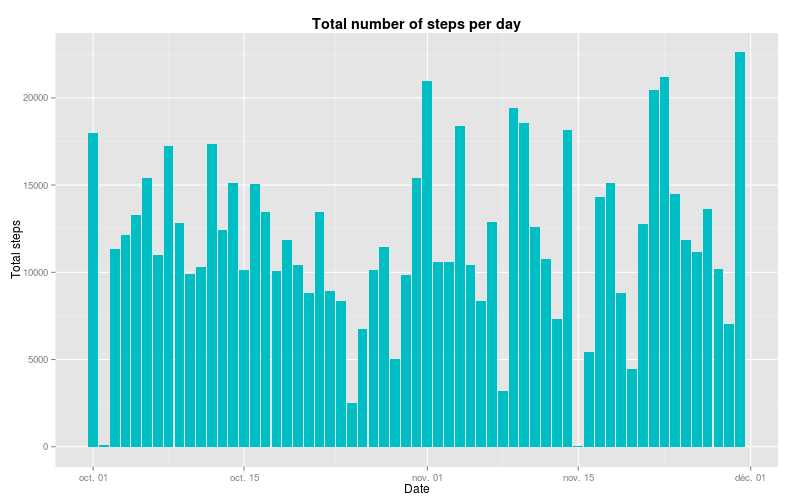
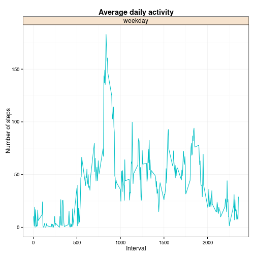

---
title: "Course_Project1"
author: "Krzysztof Jarszak"
date: "14/02/2015"
output: html_document

## Introduction

It is now possible to collect a large amount of data about personal
movement using activity monitoring devices such as a
[Fitbit](http://www.fitbit.com), [Nike
Fuelband](http://www.nike.com/us/en_us/c/nikeplus-fuelband), or
[Jawbone Up](https://jawbone.com/up). These type of devices are part of
the "quantified self" movement -- a group of enthusiasts who take
measurements about themselves regularly to improve their health, to
find patterns in their behavior, or because they are tech geeks. But
these data remain under-utilized both because the raw data are hard to
obtain and there is a lack of statistical methods and software for
processing and interpreting the data.

This assignment makes use of data from a personal activity monitoring
device. This device collects data at 5 minute intervals through out the
day. The data consists of two months of data from an anonymous
individual collected during the months of October and November, 2012
and include the number of steps taken in 5 minute intervals each day.

## Data

The data for this assignment can be downloaded from the course web
site:

* Dataset: [Activity monitoring data](https://d396qusza40orc.cloudfront.net/repdata%2Fdata%2Factivity.zip) [52K]

The variables included in this dataset are:

* **steps**: Number of steps taking in a 5-minute interval (missing
    values are coded as `NA`)

* **date**: The date on which the measurement was taken in YYYY-MM-DD
    format

* *interval*: Identifier for the 5-minute interval in which measurement was taken

## Loading and preprocessing the data  

It is assumed that you have the file activity.zip in your working directory.  


```r
activity.data <- read.csv(unzip("activity.zip"))
```

No need for the data transformation.


## What is mean total number of steps taken per day?  

I make the  table with the total number of steps taken each day, ignoring the missing values.  


```r
library(plyr)
steps.per.day <- ddply(activity.data,.(date),summarize,total.steps=sum(steps, na.rm=TRUE))

steps.per.day$date <- as.Date(steps.per.day$date, "%Y-%m-%d")
```

### 1\. Histogram of the total number of steps taken each day.  

I am using ggplot2 library to make the plot.


```r
library(ggplot2)

g <- ggplot(steps.per.day, 
            aes(x=date, 
                y=total.steps))
g <- g + geom_bar(fill="#00BFC4", stat="identity")
g <- g + labs(x = "Date") 
g <- g + labs(y = "Total steps") 
g <- g + labs(title="Total number of steps per day")
g <- g + theme(plot.title = element_text(lineheight=.8, face="bold"))
print(g)
```

 

### 2\. Calculating the mean and median total number of steps taken per day.  

I count the mean and median total number of steps taken per day.


```r
mean.steps <- mean(steps.per.day$total.steps)
median.steps <- median(steps.per.day$total.steps)
```
The mean total number of steps per day is 9354.2295082 and the median is 10395. 


## What is the average daily activity pattern?

I calculate  the average number of steps taken in each 5-minute interval, ignoring the missing values.  

```r
steps.per.interval <- ddply(activity.data,.(interval), summarize, avg.steps=mean(steps, na.rm=TRUE))
```

### 1\. Time series plot of the 5-minute interval and the average number of steps taken, averaged across all days.

I make the plot using ggplot2 library.


```r
g <- ggplot(steps.per.interval, 
            aes(x=interval, 
                y=avg.steps))
g <- g + geom_line()
g <- g + labs(x = "Interval") 
g <- g + labs(y = "Average number of steps taken") 
g <- g + labs(title="Average daily activity")
g <- g + theme(plot.title = element_text(lineheight=.8, face="bold"))
print(g)
```

 

### 2\. Which 5-minute interval, on average across all the days in the dataset, contains the maximum number of steps?


```r
max.number.steps <- steps.per.interval$interval[which.max(steps.per.interval$avg.steps)]
```
The 835 5-minute interval is  the largest number of steps on average. 

## Imputing missing values

### 1\. Calculating the total number or missing values in the dataset.  

```r
missing.values <- sum(is.na(activity.data$steps))
```
The total number or missing values is ``2304``

### 2\. Filling in all of the missing values in the dataset.  

I use mice (Multivariate Imputation by Chained Equations) for the imputation.  

```r
library(mice)

# Using Multivariate Imputation by Chained Equations
mice.data <- mice(activity.data)
```

### 3\. Creating a new dataset equal to the original dataset but with the missing values filled in.  

```r
imputed.data <- complete(mice.data)
```

### 4\. Histogram of the total number of steps taken each day.  

I calculate the total number of steps taken each day.  

```r
new.steps.per.day <- ddply(imputed.data,.(date),summarize,total.steps=sum(steps))
# Creating the date field as Date type
new.steps.per.day$date <- as.Date(new.steps.per.day$date, "%Y-%m-%d")
```

I make the plot using ggplot system.


```r
g <- ggplot(new.steps.per.day, 
            aes(x=date, 
                y=total.steps))
g <- g + geom_bar(fill="#00BFC4", stat="identity")
g <- g + labs(x = "Date") 
g <- g + labs(y = "Total steps") 
g <- g + labs(title="Total number of steps per day")
g <- g + theme(plot.title = element_text(lineheight=.8, face="bold"))
print(g)
```

 

The mean and median total number of steps taken per day for the dataset without missing values.

```r
new.mean.steps <- mean(new.steps.per.day$total.steps)
new.median.steps <- median(new.steps.per.day$total.steps)
# Do not use scientific notation
options(scipen=999)
```
The mean total number of steps taken each day is 11868.0327869 and the median is 11458. 

Now, to answer the questions: 
* Do these values differ from the estimates from the first part of the assignment? 
* What is the impact of imputing missing data on the estimates of the total daily number of steps?

The mean total number of steps taken each day before imputing missing data was 9354.2295082, and imputing missing data is 11868.0327869.  
The median total number of steps taken per day before imputing missing data was 10395, and imputing missing data is 11458.  

So, the mean and the median are larger after imputing missing data. This seems correct, as, before imputing data, some days had a total number of steps equal to 0.

## Are there differences in activity patterns between weekdays and weekends?

### 1\. Creating a new factor variable in the dataset with two levels -- "weekday" and "weekend" indicating whether a given date is a weekday or weekend day.

```r
imputed.data$day.type <- ifelse(weekdays(as.Date(imputed.data$date)) %in% c("Saturday","Sunday"), "weekend", "weekday")
imputed.data$day.type <- as.factor(imputed.data$day.type)
```

### 2\. Panel plot containing a time series plot of the 5-minute interval (x-axis) and the average number of steps taken, averaged across all weekday days or weekend days (y-axis).

I calculate the  the average number of steps taken each 5-minute interval, ignoring the missing values.  

```r
new.steps.per.interval <- ddply(imputed.data,.(interval, day.type), summarize, avg.steps=mean(steps, na.rm=TRUE))
```

Plot using ggplot system. 

```r
g <- ggplot(new.steps.per.interval, 
            aes(x=interval, 
                y=avg.steps))
g <- g + theme_bw()
g <- g + geom_line(colour="#00BFC4")
g <- g + facet_wrap( ~ day.type, ncol=1)
g <- g + labs(x = "Interval") 
g <- g + labs(y = "Number of steps") 
g <- g + labs(title="Average daily activity")
g <- g + theme(plot.title = element_text(lineheight=.8, face="bold"),
               strip.text.x = element_text(size=12),
               strip.background = element_rect(colour="black",fill="#F6E3CE"))
print(g)
```

 
